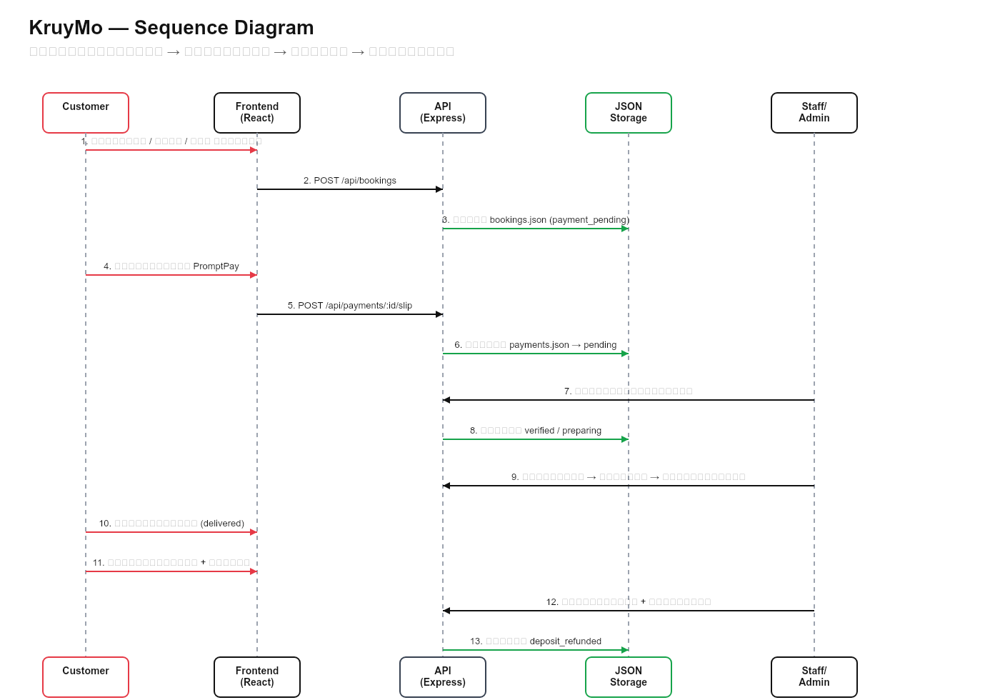

# โครงงานระบบเช่าชุดครุยออนไลน์

**จัดทำโดย**

| รหัสนักศึกษา | ชื่อ–นามสกุล |
|-------------:|--------------|
| 67142629 | นางสาวสุพิชฌาย์ แสนทวีสุข |
| 67131764 | นายพิษณุ ศิวพรพิทักษ์ |
| 67155508 | นางสาวฐิตินันท์ ดุจจานุทัศน์ |
| 67156678 | นางสาวปรายฟ้า สุขเกษม |

**เสนอ**  
อาจารย์ณัฐพล พุทธจรรยาวงศ์

รายงานนี้เป็นส่วนหนึ่งของวิชา CSI 204 คณะเทคโนโลยีสารสนเทศ  
มหาวิทยาลัยศรีปทุม

---

# ระบบเว็บไซต์สำหรับเช่าชุดครุยออนไลน์ (KruyMo)

> อ้างอิงเนื้อหาจาก [ข้อเสนอโครงงานเช่าชุดครุย.pdf](./ข้อเสนอโครงงานเช่าชุดครุย.pdf) และแผนภาพจริงใน `docs/diagrams/`

## 1. บทคัดย่อ (Abstract)

โครงงานนี้มีวัตถุประสงค์เพื่อพัฒนา **KruyMo (ครุยโม้)** ระบบเว็บไซต์สำหรับบริหารจัดการการเช่าชุดครุยออนไลน์ เพื่ออำนวยความสะดวกให้แก่ผู้ใช้บริการและเพิ่มประสิทธิภาพในการดำเนินงานของร้านเช่าชุดครุย โดยมีแนวคิดในการแก้ไขปัญหาที่เกิดขึ้นจากกระบวนการเช่าชุดครุยแบบดั้งเดิม ซึ่งผู้ใช้บริการต้องเดินทางมายังร้านหลายครั้งเพื่อสอบถามข้อมูล เลือกชุด ตรวจสอบขนาด จองคิว และติดตามสถานะการเช่า ขณะที่ผู้ประกอบการยังใช้การบันทึกข้อมูลด้วยวิธีการแบบแมนนวล ส่งผลให้เกิดความล่าช้า ความผิดพลาดในการจัดการข้อมูล และการบริหารสต็อกชุดครุย

คณะผู้พัฒนาได้ออกแบบส่วนติดต่อผู้ใช้งาน (User Interface) และประสบการณ์ผู้ใช้งาน (User Experience) ด้วยโปรแกรม Figma และพัฒนาระบบเว็บไซต์ด้วย Visual Studio Code โดยระบบสามารถรองรับการจัดการข้อมูลได้อย่างเป็นระบบผ่านฐานข้อมูลภายในของระบบ ประกอบด้วยโมดูลการทำงานหลัก ได้แก่ ระบบสมาชิกและลูกค้า ระบบจัดการข้อมูลชุดครุย ระบบจองเช่าชุด ระบบติดตามสถานะการเช่าและการคืนชุด ระบบจัดการข้อมูลลูกค้าและคำสั่งเช่า รวมถึงระบบผู้ดูแลและพนักงานสำหรับบริหารจัดการข้อมูลต่าง ๆ ภายในร้าน

ผลลัพธ์ที่คาดหวังคือระบบจะช่วยลดขั้นตอนในการให้บริการ เพิ่มความสะดวกในการจองเช่าชุดครุยและติดตามสถานะผ่านระบบออนไลน์ ลดความผิดพลาดจากการจัดเก็บข้อมูลแบบเดิม เพิ่มประสิทธิภาพในการบริหารจัดการคิวการเช่าและสต็อกชุดครุย และสนับสนุนการดำเนินงานของร้านให้มีความถูกต้อง รวดเร็ว และเป็นระบบมากยิ่งขึ้น อันสอดคล้องกับหลักการวิเคราะห์ ออกแบบ และพัฒนาระบบสารสนเทศตามแนวทางวิศวกรรมซอฟต์แวร์

## 2. บทนำ (Introduction)

### 2.1 ความเป็นมาและความสำคัญของโครงงาน

ปัจจุบันการสำเร็จการศึกษาเป็นช่วงเวลาสำคัญของนักศึกษา โดยการเข้าร่วมพิธีพระราชทานปริญญาบัตรหรือพิธีรับปริญญาจำเป็นต้องสวมใส่ชุดครุยที่ถูกต้องตามระเบียบของมหาวิทยาลัย นักศึกษาส่วนใหญ่นิยมใช้บริการเช่าชุดครุยจากร้านให้เช่า เนื่องจากมีค่าใช้จ่ายต่ำกว่าการซื้อชุดใหม่ อย่างไรก็ตาม กระบวนการเช่าชุดครุยในปัจจุบันของร้านให้เช่าหลายแห่งยังคงเป็นรูปแบบดั้งเดิม ซึ่งผู้เช่าจะต้องเดินทางไปยังร้านเพื่อสอบถามข้อมูล เลือกขนาดชุด จองคิว และรับ–คืนชุดด้วยตนเอง ทำให้เกิดความไม่สะดวก เสียเวลา และอาจเกิดข้อผิดพลาดในการจัดการข้อมูล โดยเฉพาะในช่วงฤดูกาลรับปริญญาที่มีผู้ใช้บริการจำนวนมาก

นอกจากนี้ ผู้ประกอบการร้านเช่าชุดครุยยังประสบปัญหาในการบริหารจัดการข้อมูล เช่น การบันทึกข้อมูลลูกค้าและการจองด้วยเอกสารหรือโปรแกรมพื้นฐาน การตรวจสอบจำนวนชุดคงเหลือ การติดตามสถานะการเช่าและการคืนชุด รวมถึงการจัดการข้อมูลที่ซ้ำซ้อน ซึ่งอาจส่งผลให้เกิดความผิดพลาดในการให้บริการและลดประสิทธิภาพในการดำเนินงาน

จากปัญหาดังกล่าว ผู้จัดทำจึงได้พัฒนาโครงงาน **KruyMo (ครุยโม้)** ซึ่งเป็นระบบเว็บไซต์สำหรับให้บริการเช่าชุดครุยออนไลน์ โดยมีวัตถุประสงค์เพื่ออำนวยความสะดวกให้ผู้ใช้งานสามารถสมัครสมาชิก ค้นหาและเลือกชุดครุยที่ต้องการ ตรวจสอบรายละเอียดและขนาดของชุด จองวันเช่า ติดตามสถานะการจอง และตรวจสอบสถานะการคืนชุดผ่านระบบออนไลน์ได้อย่างสะดวก ขณะเดียวกัน ผู้ดูแลระบบสามารถบริหารจัดการข้อมูลลูกค้า ข้อมูลชุดครุย รายการจอง การคืนชุด และการคืนเงินในกรณีที่เกี่ยวข้องได้อย่างเป็นระบบ ช่วยลดความผิดพลาดในการทำงานและเพิ่มประสิทธิภาพในการให้บริการ

การพัฒนาระบบดังกล่าวยังเป็นการประยุกต์ใช้เทคโนโลยีสารสนเทศเพื่อสนับสนุนการดำเนินงานของธุรกิจร้านเช่าชุดครุยให้มีความทันสมัย สอดคล้องกับพฤติกรรมของผู้บริโภคในยุคดิจิทัลที่นิยมใช้บริการผ่านเว็บไซต์และอุปกรณ์เคลื่อนที่ อีกทั้งยังช่วยยกระดับคุณภาพการให้บริการ เพิ่มความรวดเร็วในการเข้าถึงข้อมูล ลดขั้นตอนการดำเนินงาน และสร้างความพึงพอใจให้แก่ทั้งผู้ใช้บริการและผู้ประกอบการ อันนำไปสู่การบริหารจัดการร้านเช่าชุดครุยที่มีประสิทธิภาพและรองรับการขยายตัวของธุรกิจในอนาคต

คลังโค้ดโปรเจกต์: https://github.com/PhisanuJay/KruyMo

### 2.2 วัตถุประสงค์

1. เพื่อวิเคราะห์ ออกแบบ และพัฒนาระบบเว็บไซต์สำหรับเช่าชุดครุยออนไลน์ที่มีเสถียรภาพและใช้งานได้จริง  
2. เพื่อเพิ่มช่องทางและความสะดวกให้ลูกค้าสามารถดำเนินกิจกรรมเลือกชุด ระบุไซส์ และจองคิวเช่าผ่านเว็บไซต์ได้จากทุกสถานที่  
3. เพื่อลดข้อผิดพลาดในการบันทึกและจัดการข้อมูลคิวการจองอันเกิดจากการทำงานในระบบแมนนวล (Manual Error)  
4. เพื่อส่งเสริมและสนับสนุนให้ทางร้านค้าสามารถบริหารจัดการคลังสินค้า สถิติการเช่า และรายได้รวมได้อย่างมีประสิทธิภาพสูงสุด  

### 2.3 ขอบเขตของระบบ (System Scope)

ระบบแบ่งขอบเขตและหน้าที่การทำงานออกตามสิทธิ์ของผู้ใช้งาน (User Roles) 3 กลุ่มหลัก ดังนี้

#### 2.3.1 ขอบเขตด้านผู้ใช้งาน (User Roles)

- **Customer (ลูกค้า):** ทำการสมัครสมาชิก เข้าสู่ระบบ เข้าชมคู่มือแนะนำการเช่าชุด ค้นหาชุดครุยตามเงื่อนไขมหาวิทยาลัยหรือคณะวิชา ตรวจสอบรายละเอียดและขนาดไซส์ ดำเนินการจองชุดพร้อมระบุวันเวลาเช่า ชำระเงินผ่านระบบและอัปโหลดสลิป รับแจ้งเตือนยืนยัน ส่งคำขอยกเลิกการจอง และเรียกดูประวัติธุรกรรมย้อนหลังได้  
- **Staff (พนักงานร้าน):** เรียกดูข้อมูลคิวการจองล่วงหน้าเพื่อเตรียมงาน ตรวจสอบความพร้อมของตัวชุดครุย ดำเนินการอนุมัติการจองหลังจากตรวจสลิปโอนเงิน อัปเดตสถานะการส่งมอบและการรับคืนชุด บันทึกผลการตรวจสอบสภาพชุดภายหลังการใช้งาน ตรวจสอบกรณีลูกค้ายกเลิก และบันทึกข้อมูลธุรกรรมหักค่าปรับ/คืนเงินมัดจำ  
- **Admin (ผู้ดูแลระบบ):** บริหารจัดการโครงสร้างข้อมูลพื้นฐานของระบบเช่าทั้งหมด (เพิ่ม เรียกดู แก้ไข ลบข้อมูลชุดครุย ข้อมูลมหาวิทยาลัย และคณะวิชา) และเข้าถึง Dashboard เพื่อประเมินสถิติเชิงบริหาร  

#### 2.3.2 ขอบเขตด้านฟังก์ชัน (Functional Features)

- **ระบบสมาชิกและความปลอดภัย:** JWT อายุ 7 วัน รหัสผ่านเข้ารหัสด้วย bcrypt และ OTP ยืนยันอีเมล/รีเซ็ตรหัสผ่าน  
- **ระบบการจองและคำนวณไซส์:** ตรวจสอบสิทธิ์การจองแบบเรียลไทม์เพื่อไม่ให้เกิดการจองซ้ำในไซส์เดียวกันและเวลาเดียวกัน  
- **ระบบชำระเงิน PromptPay:** แสดง QR ในนาม KruyMo พร้อมอัปโหลดสลิป  
- **ระบบปฏิบัติการจัดส่ง–รับคืน–คืนมัดจำ:** คิวงานแยกตามสถานะ และคืนมัดจำหลังหักค่าปรับ  
- **ระบบแสดงผลสารสนเทศ (Dashboard):** ประมวลผลข้อมูลรายได้รวมยอดขาย อัตราสถิติความนิยมในการเช่าจำแนกตามสถาบัน และยอดคงคลังคงเหลือ  

## 3. การศึกษาที่เกี่ยวข้อง (Literature Review)

คณะผู้จัดทำได้ทำการรวบรวมศึกษาทฤษฎี เอกสารวิจัย และระบบงานใกล้เคียงเพื่อนำมาประยุกต์ใช้ในการพัฒนาโครงการ ดังนี้

- **การศึกษากระบวนการ E-Commerce และการจองคิวบริการออนไลน์:** ศึกษาแบบแผนพฤติกรรมผู้บริโภคในการเลือกซื้อและเช่าสินค้าออนไลน์เพื่อออกแบบ Workflow การกรอกข้อมูลและการอัปโหลดสลิปธนาคารให้สั้น กระชับ และเข้าใจง่ายที่สุด  
- **การศึกษาเครื่องมือทางเทคโนโลยี:**
  - **Figma:** ใช้ในการทำแบบจำลองหน้าจอความละเอียดสูง (High-Fidelity Prototype) เพื่อทดสอบ User Experience ก่อนการเขียนโค้ด  
  - **Visual Studio Code:** ซอฟต์แวร์สภาพแวดล้อมการพัฒนาหลัก (IDE) รองรับการเขียนโค้ดและสคริปต์การทำงาน  
  - **Git และ GitHub:** นำระบบคลังข้อมูลออนไลน์มาบริหารการพัฒนาโปรเจกต์ ร่วมกันทำงานในทีม และควบคุมเวอร์ชันของระบบ  
  - **React + Vite + React Router + Axios:** พัฒนา Frontend  
  - **Node.js + Express + Multer + Nodemailer:** พัฒนา Backend API อัปโหลดไฟล์ และส่งอีเมล  
  - **JWT + bcryptjs:** ยืนยันตัวตนและเข้ารหัสรหัสผ่าน  
  - **JSON File Storage:** จัดเก็บข้อมูลโดยไม่ต้องติดตั้งฐานข้อมูลภายนอก ตามขอบเขตโครงงานรายวิชา  

## 4. การวิเคราะห์ระบบ (System Analysis)

### 4.1 Problem Statement (ปัญหาของระบบเดิม)

ระบบเดิมใช้การประสานงานแบบแมนนวลและจดบันทึกบนกระดาษเป็นหลัก ส่งผลให้ค้นหาข้อมูลอ้างอิงออเดอร์เก่าได้ยาก ข้อมูลสต็อกสินค้าไม่มีการอัปเดตแบบทันที ทำให้หน้าร้านประสบปัญหาปล่อยเช่าชุดเกินจำนวนสต็อกที่มีอยู่จริง (Inventory Over-allocation) สร้างความเสียหายและส่งผลกระทบต่อภาพลักษณ์ของร้านค้าในวันงานสำคัญของลูกค้า

### 4.2 Requirement Analysis

**Functional Requirements**

- สมัครสมาชิก ยืนยันอีเมลด้วยรหัส OTP 6 หลัก อายุ 10 นาที พยายามได้ไม่เกิน 5 ครั้ง และส่งซ้ำได้ทุก 60 วินาที  
- เข้าสู่ระบบด้วยอีเมล/รหัสผ่าน และบังคับยืนยันอีเมลก่อนใช้งาน  
- ลืมรหัสผ่านและตั้งรหัสผ่านใหม่ด้วย OTP ทางอีเมล  
- แสดงรายการชุดครุยศรีปทุม ค้นหา/กรองตามคณะ และดูรายละเอียดชุด  
- เลือกระดับปริญญา ไซส์ วันเริ่ม–วันสิ้นสุด และตรวจสอบชุดว่างก่อนจอง  
- เพิ่มลงตะกร้าหรือรายการโปรด และเช็คเอาต์หลายชุดได้  
- สร้างการจองพร้อมคำนวณราคา = (ราคาต่อวัน × จำนวนวัน) + มัดจำ  
- ชำระเงิน PromptPay อัปโหลดสลิป และระบุบัญชีรับเงินมัดจำคืน (PromptPay หรือบัญชีธนาคาร)  
- ยกเลิกการจองที่ยังไม่ชำระ และระบบยกเลิกอัตโนมัติหากค้างชำระเกิน 24 ชั่วโมง  
- พนักงานตรวจสลิป อนุมัติหรือปฏิเสธ พร้อมเหตุผลเมื่อปฏิเสธ  
- พนักงานจัดเตรียมชุด มอบแมสเซนเจอร์ (ชื่อ เบอร์ ช่วงเวลาส่ง หมายเหตุ) และอัปเดตสถานะจัดส่ง  
- ลูกค้ายืนยันรับชุด แจ้งส่งคืนพร้อมรูปภาพ และพนักงานรับเข้าคลังพร้อมบันทึกค่าปรับ  
- พนักงานคืนมัดจำโดยอัปโหลดสลิปโอนคืน และคำนวณยอดสุทธิ = มัดจำ − ค่าปรับ  
- แอดมินจัดการชุดครุย สต็อก ผู้ใช้ ข้อมูลหลัก รายงานรายได้ (ส่งออก CSV) บันทึกกิจกรรม และเทมเพลตแจ้งเตือน  

**Non-functional Requirements**

- **Usability:** ส่วนติดต่อผู้ใช้งาน (UI) ต้องได้รับการออกแบบให้สอดคล้องกับหลัก Responsive Design เพื่อรองรับสมาร์ตโฟนและแท็บเล็ต  
- **Performance:** อัตราการประมวลผลและการสืบค้นสต็อกสินค้าคงคลังต้องใช้เวลาโหลดไม่เกิน 3 วินาทีต่อหนึ่งการค้นหา  
- **Security:** รหัสผ่านของผู้ใช้งานทั้งหมดต้องได้รับการเข้ารหัส (Encryption) ก่อนจัดเก็บลงฐานข้อมูล  

### 4.3 Persona Design

เพื่อให้การออกแบบระบบสอดคล้องกับผู้ใช้งานจริง คณะผู้จัดทำได้กำหนด Persona หลัก 3 กลุ่ม ดังนี้

- **Persona 1 ลูกค้า:** ต้องการจองชุดครุยคณะตนเองให้ทันวันรับปริญญา โดยใช้มือถือเป็นหลัก และต้องการติดตามสถานะการจอง การจัดส่ง และการคืนมัดจำได้อย่างชัดเจน  
- **Persona 2 พนักงานร้าน:** ต้องการคิวงานรวมสำหรับตรวจสลิป จัดเตรียมชุด จัดส่งด้วยแมสเซนเจอร์ รับคืนชุด และคืนเงินมัดจำ เพื่อลดความผิดพลาดและทำงานได้ทันกำหนด  
- **Persona 3 ผู้ดูแลระบบ:** ต้องการควบคุมสต็อกชุดตามคณะ ไซส์ และระดับการศึกษา จัดการข้อมูลหลัก ผู้ใช้ และดูรายงานภาพรวมของร้าน  

## 5. การออกแบบระบบ (System Design)

### 5.1 Use Case Diagram

แผนภาพ Use Case แสดงบทบาทผู้ใช้หลักของระบบ ได้แก่ Customer, Staff และ Admin รวมถึง Use Case สำคัญ เช่น สมัครสมาชิก จองชุด ชำระเงิน ติดตามสถานะ ตรวจสลิป จัดส่ง รับคืน คืนมัดจำ และจัดการข้อมูลหลัก

*รูปที่ 5.1 Use Case Diagram ของระบบ KruyMo*

### 5.2 Class Diagram

แผนภาพ Class แสดงโครงสร้างคลาสและความสัมพันธ์หลักของระบบ เช่น User, Booking, Payment, Costume, Inventory, Faculty, University และ Size

*รูปที่ 5.2 Class Diagram ของระบบ KruyMo*

### 5.3 Sequence Diagram

แผนภาพ Sequence แสดงลำดับการทำงานหลักของระบบ ตั้งแต่ลูกค้าสร้างการจอง ชำระเงินและอัปโหลดสลิป พนักงานตรวจสลิป จัดเตรียมชุด จัดส่งด้วยแมสเซนเจอร์ จนถึงรับคืนชุดและคืนเงินมัดจำ

*รูปที่ 5.3 Sequence Diagram วงจรจองชุดครุยของระบบ KruyMo*

### 5.4 System Architecture

สถาปัตยกรรมระบบแบ่งเป็นชั้น Presentation (React SPA) Application (Express REST API + JWT + Multer) และ Data (ไฟล์ JSON + โฟลเดอร์ uploads) พร้อมบริการภายนอก Gmail SMTP สำหรับ OTP และ PromptPay แบบแมนนวลสำหรับการชำระเงิน

*รูปที่ 5.4 System Architecture ของระบบ KruyMo*

### 5.5 Data Schema

โครงข้อมูลของระบบจัดเก็บในรูปแบบไฟล์ JSON ภายใต้ `backend/data` โดยมีศูนย์กลางที่รายการจอง (bookings) และเชื่อมโยงกับผู้ใช้ การชำระเงิน ชุดครุย สต็อก และข้อมูลหลักอื่น ๆ

*รูปที่ 5.5 Data Schema (ER-style) ของระบบ KruyMo*

สรุปไฟล์ข้อมูลหลัก

| ไฟล์ | คำอธิบายสั้น ๆ |
|------|----------------|
| `users.json` | ผู้ใช้ บทบาท ที่อยู่ บัญชีรับมัดจำคืน |
| `costumes.json` / `inventory.json` | ชุดครุยและสต็อกตามไซส์×ระดับปริญญา |
| `universities.json` / `faculties.json` / `sizes.json` | ข้อมูลหลัก |
| `bookings.json` | การจอง จัดส่ง รับคืน คืนมัดจำ |
| `payments.json` | สลิปและสถานะตรวจชำระเงิน |
| `cart.json` / `favorites.json` / `notifications.json` | ฟังก์ชันเสริม |

### 5.6 Wireframe / Prototype

ออกแบบ High-Fidelity Prototype ด้วย Figma ครอบคลุมหน้า Login/Register ฝั่งลูกค้า พนักงาน และแอดมิน

Figma: https://www.figma.com/design/Ik7O3CELdlj20X0goUSwfL/Untitled?node-id=0-1&p=f&t=brxmYBMEXTVsvpr5-0

#### หน้าจอหลักที่พัฒนาแล้วในระบบจริง

**ฝั่งลูกค้า**

- หน้าแรก `/` · วิธีเช่า `/how-to-rent` · เกี่ยวกับเรา `/about`  
- แคตตาล็อก `/catalog` · รายละเอียดชุด `/costume/:id` · จอง `/booking/:id`  
- ชำระเงิน `/payment/:bookingId` · ประวัติการจอง `/bookings`  
- ตะกร้า `/cart` · รายการโปรด `/favorites` · โปรไฟล์ `/profile`  

**ฝั่งพนักงาน**

- แดชบอร์ด `/staff` · คำสั่งเช่า `/staff/bookings` · จัดส่ง–รับคืน `/staff/dispatch` · คืนมัดจำ `/staff/refund`  

**ฝั่งแอดมิน**

- แดชบอร์ด `/admin` · ชุดครุย/สต็อก `/admin/costumes` · ข้อมูลหลัก `/admin/master-data`  
- ผู้ใช้ `/admin/users` · รายงาน `/admin/reports` · บันทึกกิจกรรม `/admin/activity`  

## 6. เทคโนโลยีที่ใช้ (Technology Stack)

| ประเภทของเครื่องมือ / ส่วนงาน | เทคโนโลยีและซอฟต์แวร์ที่ใช้ในโครงการ |
|-------------------------------|--------------------------------------|
| Frontend | React 18, Vite 6, React Router 7, Axios, Lucide React, thai-address-database |
| Backend | Node.js, Express 4, Multer, UUID, dotenv, cors |
| Authentication | jsonwebtoken, bcryptjs |
| Email | Nodemailer (Gmail SMTP พอร์ต 465) |
| UI/UX Design & Prototype | Figma |
| Version Control | Git / GitHub Repository |
| Data Storage | JSON files ใน `backend/data` และไฟล์สลิป/รูปใน `uploads/` |
| Integrated Development Environment (IDE) | Visual Studio Code |

## 7. การพัฒนาระบบและคลังโค้ด

- Frontend พัฒนาด้วย React + Vite แยก Layout ตามบทบาท มี ProtectedRoute คุมสิทธิ์  
- Backend พัฒนาด้วย Express มีเส้นทางหลัก `/api/auth` `/api/costumes` `/api/bookings` `/api/payments` `/api/cart` `/api/favorites` `/api/users` `/api/reports` และอัปโหลดไฟล์  
- จัดเก็บข้อมูลด้วยไฟล์ JSON ตามขอบเขตโครงงานรายวิชา  
- คลังโค้ด: https://github.com/PhisanuJay/KruyMo  

เอกสารทดสอบระบบ: [User_Acceptance_Testing.pdf](./User_Acceptance_Testing.pdf)

## 8. ผลที่คาดว่าจะได้รับ (Expected Benefits)

- ผู้ใช้บริการได้รับความพึงพอใจเพิ่มขึ้นจากฟังก์ชันการจองชุดครุยแบบออนไลน์ล่วงหน้าได้ตลอด 24 ชั่วโมง  
- ช่วยลดปริมาณงานและระยะเวลาในการประสานงานของร้านค้าลง  
- เพิ่มความแม่นยำในการบันทึกรายได้และควบคุมจำนวนสต็อกชุดครุย ไม่ให้เกิดข้อผิดพลาดในการดำเนินงาน  
- ส่งเสริมความโปร่งใส ตรวจสอบสถานะการเงินและการคืนเงินมัดจำผ่านระบบอิเล็กทรอนิกส์  

## ภาคผนวก

### ก. วิธีรันระบบ

1. เข้าโฟลเดอร์ `backend` แล้วรัน `npm install` และ `npm start` (พอร์ต 3001)  
2. เข้าโฟลเดอร์ `frontend` แล้วรัน `npm install` และ `npm run dev` (พอร์ต 5173)  
3. เปิดเบราว์เซอร์ที่ http://localhost:5173  

### ข. บัญชีทดสอบ

- Admin: `admin@gmail.com` / `12345678`  
- Staff: `staff@gmail.com` / `12345678`  
- Customer: `customer@gmail.com` / `12345678`  

### ค. ไฟล์แผนภาพประกอบ

1. [Use Case](./diagrams/KruyMo-usecase.png)  
2. [Class Diagram](./diagrams/KruyMo-class-diagram.png)  
3. [Sequence Diagram](./diagrams/KruyMo-sequence-diagram.png)  
4. [System Architecture](./diagrams/KruyMo-system-architecture.png)  
5. [Data Schema](./diagrams/KruyMo-data-schema.png)  

### ง. เอกสารอ้างอิง

- [ข้อเสนอโครงงานเช่าชุดครุย.pdf](./ข้อเสนอโครงงานเช่าชุดครุย.pdf)  
- [User Acceptance Testing](./User_Acceptance_Testing.pdf)  
- [SDLC Tools](./SDLC_Tools_KruyMo.md)  
